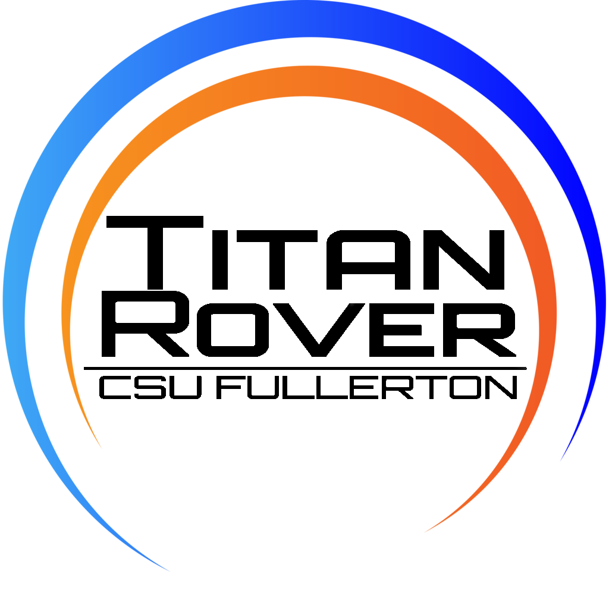

# TitanRover2019
## California State University, Fullerton
## TitanRover website: titanrover.com
--------

This year's implementation of the rover will be built on the ROS Platform!

Using ROS as the backbone all communications/commands from the basestation are published into a custom TitanRover Topic containing all movement instructions. We have built listening services to automatically run in background to automate when commands published. 

This rover has been designed to compete in the University Rover Challenge(URC) against other universities around the world. Visit the URC website for more information: urc.marssociety.org . 

-------
Primary Programmers:
Anette Ulrichsen        -   amulrichsen@csu.fullerton.edu
Armon Rahimi            -   armon16@csu.fullerton.edu
Christopher Weichlein   -   cweichlein@gmail.com
David Feinzimer         -   dfeinzimer@gmail.com
Georden Grabuskie       -   ggrabuskie@csu.fullerton.edu
Maria Diaz              -   mardiaz353@csu.fullerton.edu
Robert Pace IV          -   rpaceiv@csu.fullerton.edu
Timothy Parks           -   parkstimothyj@csu.fullerton.edu
